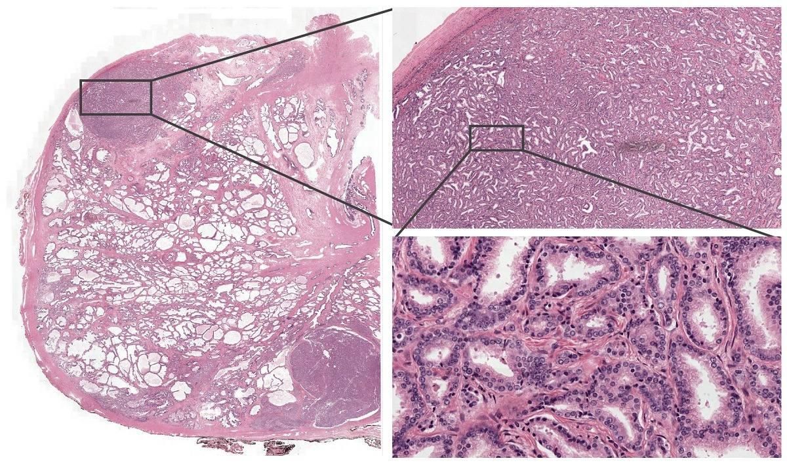

# MIL-WSI

**What are MIL and WSI?**

Multi-Instance Learning (MIL) is one type of semi-supervised learning technique. In a nutshell, MIL is a semi-supervised learning in a sense that labels are provided for each bag which include multiple instances. There is a great introduction about MIL in this [blog](https://nilg.ai/blog/202105/an-introduction-to-multiple-instance-learning/) if you need more details about this technique. 



As shown above, Whole Slide Images (WSI) refers to a single high-resolution digital file of a complete microscope slide. This is commonly achieved by capturing many small high-resolution image tiles or strips and then montaging them to create a full image of a histological section. In pathology, professionals deal with WSIs to diagnose cancer, manage chronic diseases, and conduct accurate laboratory testing. Just like every other fields, deep learning is getting implemented in pathology. However, especially in WSI classification, it is challenging to utilize such technique due to their ultra high resolution (~60K). Hence, researchers have tried to use MIL to subdivide WSI into multiple ROIs to reduce the overall dimension of the WSI while maintaining detail features and patterns of tissues. 

This repository contains a simple MIL model, training pipeline, and etc for ***binary classification***. Note that PyTorch does not have a built-in classes to handle bag-wise dataloading. Therefore, necessary features and functions (e.g., epoch and dataset shuffle) is custom built to train and test the MIL model.

## Installation

 - Clone this repository:
   ```Shell
   git clone https://github.com/kidpaul94/MIL_WSI.git
   ```
 - Download dependencies:
   ```Shell
   pip3 install pyvips
   ```
   Note: I prefer to read a very large WSI (.tif file) using pyvips. You can use any other packages that can handle large images. 
   
## WSI pre-processing

Following is the folder structure required to train and test the MIL in this repository.

    ├── train                    # Train dataset
    │   ├── class_01             # Class folder
    │   │   ├── image01_000.png  # tiled image of an original WSI
    │   │   ├── image01_001.png         
    |   │   └── image01_002.png
    |   └── class_02
    ├── train.csv                #.csv file which saves the number of tiles for each WSI
    ├── test                     
    │   ├── image03_000.png          
    │   ├── image03_001.png         
    │   └── image03_002.png              
    └── test.csv
To generate tiles for each WSI, run [make_tiles](https://github.com/kidpaul94/MIL-WSI/blob/a00c6ea1bf09d57879c3fea3d86a9d3585d72bcc/utils.py#L51).
Then follow [Imagenet](https://www.image-net.org/) dataset folder structure and organize the preprocessed images. Once this is done, you can simply
run [tile_track](https://github.com/kidpaul94/MIL-WSI/blob/a00c6ea1bf09d57879c3fea3d86a9d3585d72bcc/utils.py#L91) to generate .csv files shown above.

## Training & Inference

 - How to train the network:
   ```Shell
   python3 train.py 
   ```
 - How to perform inference:
   ```Shell
   python3 eval.py 
   ```
   
**ToDo Lists**

- [x] Add train.py, eval.py, and other necessary files for data preprocessing.
- [x] Add some description about how pre-processing of WSIs is done.
